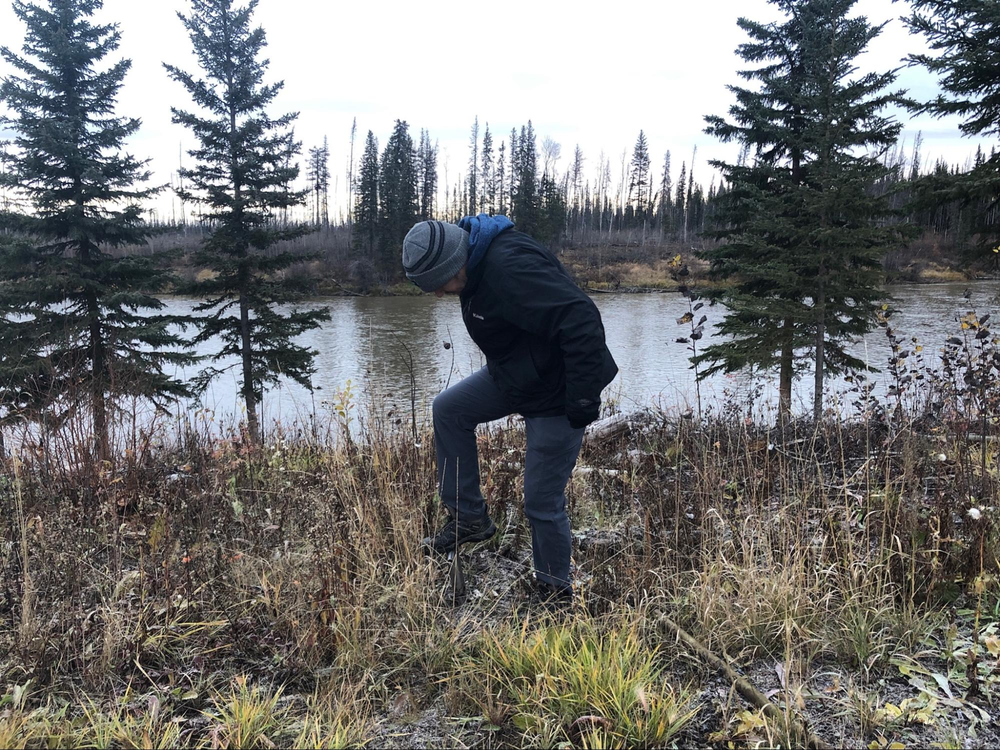
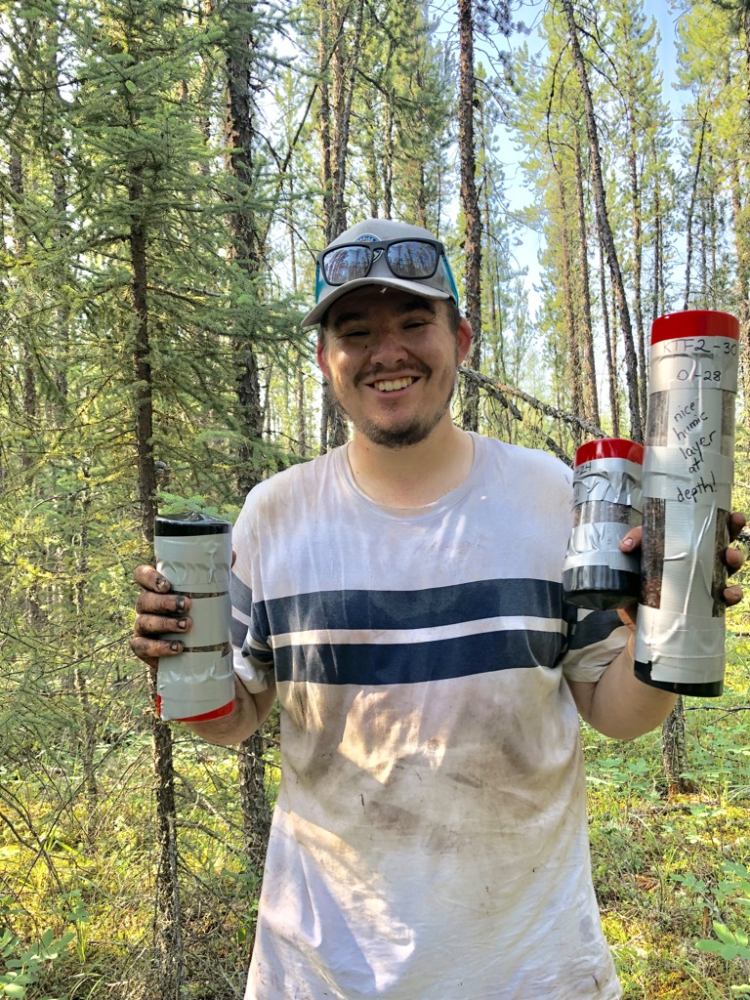
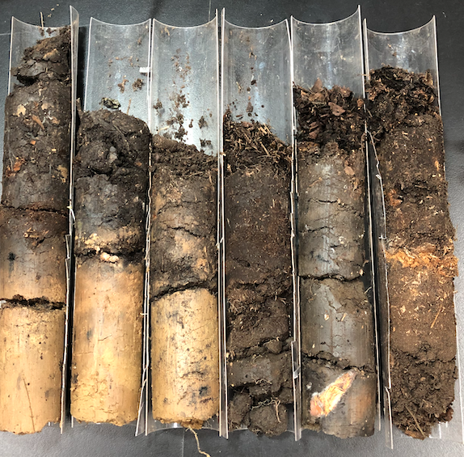
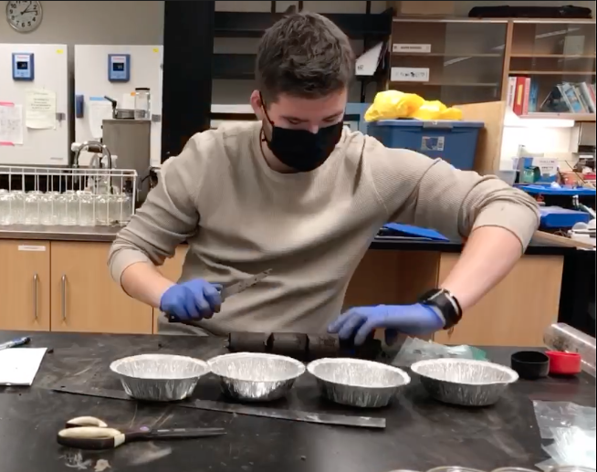
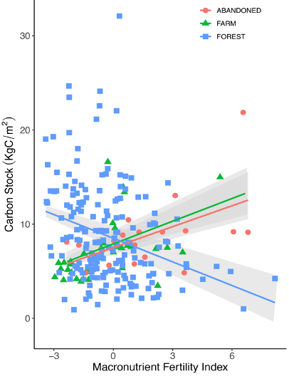
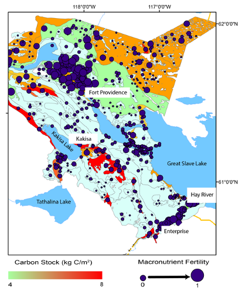

### Case Study 2: Soil carbon trade-offs associated with agricultural land use change in the Northwest Territories

#### Step 1: Choosing representative sites and study areas

 

Caption: We partnered with communities in the Northwest Territories, Canada such as Kakisa (shown here) to understand carbon and fertility trade-offs associated with agricultural cultivation of the boreal forest

 

Caption: In 2019, a soil sampling effort was conducted to assess the soil fertility and carbon content of sites that communities were interested in for agricultural development. Study sites were selected across a gradient of potential agriculture suitability ranging from class 3 (potentially the most suitable for agriculture) to class 7 (likely unsuitable for agriculture). Sites were also selected based on input from local community members

 

Caption: In 2021, a soil collection effort was undertaken to understand how soil fertility and carbon change between three different land use types; pre-cultivated forest soil, active agricultural soils, and abandoned agricultural soils. In partnership with seven farmers, 22 total sites were sampled. 

#### Step 2: Collection of soil cores

 

Caption: 30m transects were established at each selected sample location

 

 

Caption: Cores were collected using a 30cm or 60cm stainless steel soil corer to capture the entire organic layer of the site. For each transect, six soil cores were collected. Once extracted from the ground, cores were placed and sealed in plastic tubes.

 

Caption: Soil cores were stored in a freezer to limit decomposition processes. Upon departure from the Northwest territories, samples were shipped back to the University of Guelph and stored at 4 degrees celsius. 

#### Step 3: Processing of cores in the lab

 

Caption: The entirety of the organic layer of the soil cores was analyzed to determine soil macronutrient fertility (consisting of nitrogen, phosphorus, and potassium) as well as soil organic carbon stocks.

 

Caption: Soil cores were subdivided into 5cm increments to assess how variables change with depth throughout the core

 

Caption: In total over 1500lbs of soil was analyzed and processed  from 2019-2022 in support of this project. 

#### Step 4: Data interpretation

 

Caption: Based on the soil data we collected and the results of a global synthesis of studies, we found that soil organic carbon stocks significantly decline with increasing time since cultivation. This is concerning as the boreal forest represents the largest pool of terrestrial carbon.

 

Caption: We also found differing relationships between soil organic carbon and soil fertility in our study sites. In agricultural soils (both active and abandoned) soil fertility and soil carbon are positively correlated. In pre-cultivation or undisturbed sites, soil fertility and soil carbon are negatively correlated. This negative correlation is important from a land management perspective as we can target areas of high fertility, but low soil carbon to limit potential carbon losses.

 

Caption: We were able to use the soil data to create a map that highlights areas of lower amounts of soil organic carbon (shown in white) and high macronutrient fertility (larger circles). This serves as a preliminary land management tool that can help communities make decisions that limit carbon losses upon cultivation
