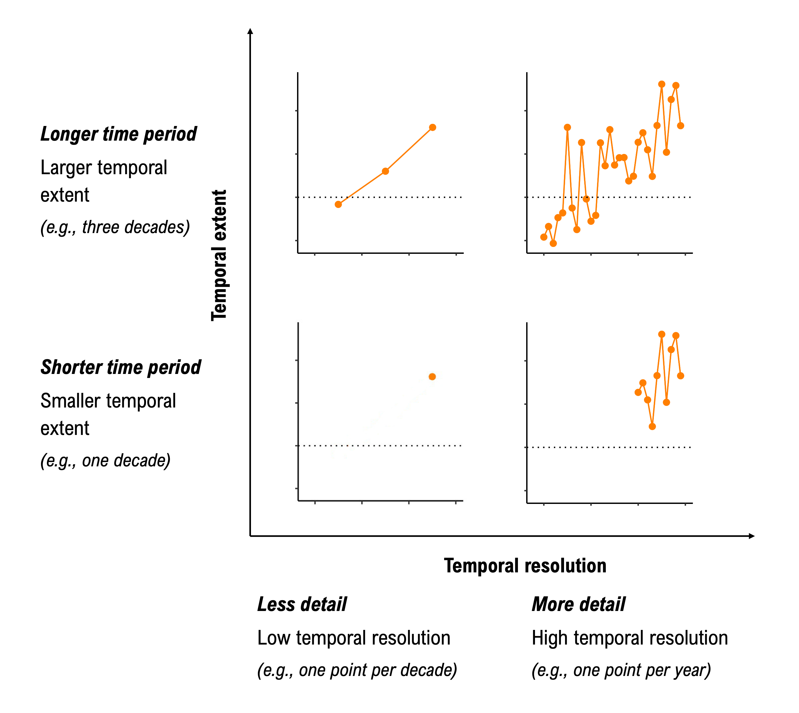

# Nature’s contributions to people: a multi-scale perspective

We, as scientists and researchers, often take a multi-scale perspective to better understand how natural ecosystems improve people’s lives. These beneficial contributions by ecosystems are called **Nature’s contributions to people**, NCPs. NCPs can also be called nature’s gifts or ecosystem services.

 

Image credit: illustrated by Ágnes Vári.
<!---Justify left, text listed above should be to the right of this figure --->

Taking a **multi-scale perspective**, means that we can measure things at **fine or small scales**, for example at the scale of ants or even smaller by measuring carbon in a handful of soil and we can use instruments at **broad or large scales** that give us a bird's eye perspective of larger ecological patterns and processes. 

 

Image credit: illustrated by Ágnes Vári.
<!---Justify left, text listed above should be to the right of this figure --->

 

Image credit: illustrated by Ágnes Vári.
<!---Justify left, text listed above should be to the right of this figure --->

We are part of **ResNet**, a network which unites a broad community of scholars, nongovernmental organizations, government agencies, and industry sectors. We work in different regions of Canada, with a common goal of improving how we monitor, model, and manage nature’s contributions to people. In the sections below, together as a subset of members of ResNet, we 

1) discuss the importance of taking a multi-scale perspective,

2) define what we mean by spatial and temporal scales, and

3) introduce a few challenges and best practices related to scaling.

As scientists and researchers, we often design studies at different scales, because 

1) decision-makers require data at different spatio-temporal scales, 

2) scientists seek to understand how ecosystem processes and properties vary across scales, and 

3) there are cost and time constraints to collecting data; therefore, we target the scale most relevant for a given question or decision.

 
Image credit: Amanda Schwantes

<!--- Justify middle, no text on sides --->

Sometimes data is only available (or can only be collected) at one scale; however, we need information at a different scale to inform a decision or to understand an ecological process. We may scale up or down for many reasons, including…
   
1) It can be expensive, time-consuming, and dangerous to **collect data in the field** at every possible location. Instead, we divide a larger landscape into smaller similar areas and take representative samples within each group.

2) Ecological processes can be difficult to observe directly, including when **processes are too fast, too slow, too small, or too large**. We develop models to visualize a reality that is inaccessible to our senses. 

3) **Management and policy decisions** may require data at a different scale (e.g., study area or amount of detail) compared to the scale of available data. For example, we may collect field data about a management intervention within a smaller local study area; however, we may rely on models to test how scaling these interventions could affect outcomes for a broader larger study region.

4) Sometimes data are only available for a large region (e.g., population data of a neighborhood), but we may **need data at a finer resolution** to answer key questions (e.g., how many people within a neighborhood live along a river prone to flooding?).

## Spatial and temporal scales

As scientists and researchers, we often work at different scales to measure different parts of a landscape or ecosystem. We can measure ecosystems at different scales across **space** (e.g., spatial) or across **time** (e.g., temporal). We can also ask “**how big?**” (e.g., what is the extent?) or “**how much detail?**” (e.g., what is the resolution?).

 
Caption: When we move from the bottom to the top images, we are increasing the size of the study area (e.g., spatial extent). When we move from the left to the right images, we are increasing the number of pixels per area (e.g., spatial resolution), which allows for individual flowers to be distinguished. Image credit: Amanda Schwantes.

<!--- Justify middle, no text on sides -->

 
Caption: When we move from the bottom to the top images, we are expanding the time period for which we are collecting data. When we move from the left to the right images, we are increasing the detail (e.g., number of data points per year). Image credit: Amanda Schwantes.

<!--- Justify middle, no text on sides -->

## The spatial and temporal scales of our studies

Research within ResNet takes place across Canada. Here, we show the spatial extent of a selection of our research projects. Each polygon or group of polygons represents the area of study for a project. The icons within the scatter graph represent a subset of  research projects within ResNet. Hover over each icon to learn more about each project.

<!---[Add story map and scatter graphs of the scales at which we work] --->

## Sometimes we move between scales, which creates key challenges and opportunities

When we scale up or down, many challenges can arise. For example the method choices we make can lead to misleading results as we extend our research to other scales. Here, we, as a subset of students and researchers in ResNet, illustrate many of these challenges and provide opportunities for overcoming them.

 
Image credit: Amanda Schwantes.

To learn more about each challenge, click on the title below: 
<!---[Add in finalized list of challenges: Matches what’s described in dropdown menu] --->

