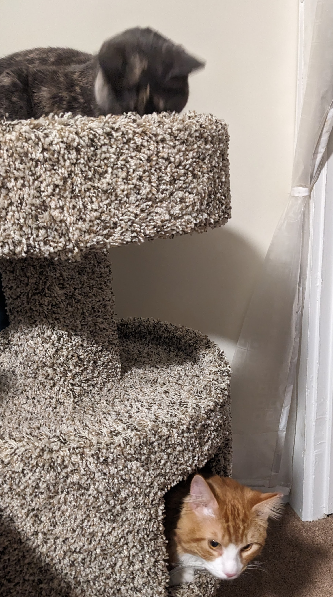

# Images and Figures

Images and figures are also inserted using markdown syntax, with additional arguments for controlling size, position, and caption.

## Images

An `image` is a static visuals used for basic decoration. Scientific figures should use the `figure` syntax, described in the next section, which includes a descriptive caption and allows users to click to view a larger version.

### Basic Syntax

```markdown

``` 


--- 

### Adjusting Size

Use the `width` argument to adjust size.

```markdown

{width="50vw"}
<!-- Use vw to set width relative to the browser screen width. -->

``` 


{width="50vw"}  

```markdown

{width="50%"}
<!-- Use % to set width relative to panel width. -->

``` 


{width="50%"}  

--- 

### Adjusting Position

#### Center

```markdown

{center="TRUE"}
```

{center="TRUE"}

---

#### Float

`float` aligns an image to the left or right, allowing other content to flow around it.

---

##### Left

```markdown

{float="left"} 
<!-- Place above the text/content to flow around -->
```

{float="left"} 

Lorem ipsum dolor sit amet, consectetur adipiscing elit. Sed iaculis lectus consequat ex viverra, id sagittis tortor interdum. Vestibulum sollicitudin pellentesque mi, quis malesuada mauris pulvinar eu. Nunc ut lacus ac erat eleifend ornare. Morbi eget cursus nulla. Aliquam at porttitor mi, vel viverra velit. Maecenas ex neque, varius et neque id, viverra ullamcorper erat. Quisque commodo nisl ut ex varius venenatis. Etiam vel tortor sapien. Aliquam id scelerisque lacus, at ultricies nibh. Vivamus posuere feugiat lacus, ac lacinia ante sagittis eu.
{.dummy-text} 

Vivamus eget sagittis nunc, non vehicula augue. In accumsan nisl in lorem dignissim rutrum. Maecenas tincidunt rutrum sodales. Aliquam erat volutpat. Donec condimentum dictum vehicula. Vivamus quam erat, suscipit a aliquam id, eleifend sit amet tellus. Aenean sit amet leo aliquam, interdum massa quis, dapibus nulla. Duis maximus ultrices tempus. Morbi sodales tincidunt ligula ut auctor. In maximus hendrerit tincidunt. Sed condimentum maximus molestie. Sed at libero luctus, sollicitudin dolor sed, viverra neque. Nunc est diam, euismod eu placerat eget, luctus vitae eros. Morbi sit amet laoreet risus, vel interdum mi. Nullam vestibulum vulputate magna, quis tincidunt dui ornare vel. Morbi hendrerit suscipit libero eu vulputate.
{.dummy-text} 

---

##### Float Right

```markdown

{float="right"} 
<!-- Place above the text/content to flow around -->
```

Lorem ipsum dolor sit amet, consectetur adipiscing elit. Sed iaculis lectus consequat ex viverra, id sagittis tortor interdum. Vestibulum sollicitudin pellentesque mi, quis malesuada mauris pulvinar eu. Nunc ut lacus ac erat eleifend ornare. Morbi eget cursus nulla. Aliquam at porttitor mi, vel viverra velit. Maecenas ex neque, varius et neque id, viverra ullamcorper erat. Quisque commodo nisl ut ex varius venenatis. Etiam vel tortor sapien. Aliquam id scelerisque lacus, at ultricies nibh. Vivamus posuere feugiat lacus, ac lacinia ante sagittis eu.
{.dummy-text} 


{float="right"} 

Vivamus eget sagittis nunc, non vehicula augue. In accumsan nisl in lorem dignissim rutrum. Maecenas tincidunt rutrum sodales. Aliquam erat volutpat. Donec condimentum dictum vehicula. Vivamus quam erat, suscipit a aliquam id, eleifend sit amet tellus. Aenean sit amet leo aliquam, interdum massa quis, dapibus nulla. Duis maximus ultrices tempus. Morbi sodales tincidunt ligula ut auctor. In maximus hendrerit tincidunt. Sed condimentum maximus molestie. Sed at libero luctus, sollicitudin dolor sed, viverra neque. Nunc est diam, euismod eu placerat eget, luctus vitae eros. Morbi sit amet laoreet risus, vel interdum mi. Nullam vestibulum vulputate magna, quis tincidunt dui ornare vel. Morbi hendrerit suscipit libero eu vulputate.
{.dummy-text} 

Lorem ipsum dolor sit amet, consectetur adipiscing elit. Sed iaculis lectus consequat ex viverra, id sagittis tortor interdum. Vestibulum sollicitudin pellentesque mi, quis malesuada mauris pulvinar eu. Nunc ut lacus ac erat eleifend ornare. Morbi eget cursus nulla. Aliquam at porttitor mi, vel viverra velit. Maecenas ex neque, varius et neque id, viverra ullamcorper erat. Quisque commodo nisl ut ex varius venenatis. Etiam vel tortor sapien. Aliquam id scelerisque lacus, at ultricies nibh. Vivamus posuere feugiat lacus, ac lacinia ante sagittis eu.
{.dummy-text} 


---

##### Clearing Floats

Multiple adjacent floats may overlap undesirably.

```markdown

{float="right"} 


{float="right"} 
```


{float="right"} 


{float="right"} 

Vivamus eget sagittis nunc, non vehicula augue. In accumsan nisl in lorem dignissim rutrum. Maecenas tincidunt rutrum sodales. Aliquam erat volutpat. Donec condimentum dictum vehicula. Vivamus quam erat, suscipit a aliquam id, eleifend sit amet tellus. Aenean sit amet leo aliquam, interdum massa quis, dapibus nulla. Duis maximus ultrices tempus. Morbi sodales tincidunt ligula ut auctor. In maximus hendrerit tincidunt. Sed condimentum maximus molestie. Sed at libero luctus, sollicitudin dolor sed, viverra neque. Nunc est diam, euismod eu placerat eget, luctus vitae eros. Morbi sit amet laoreet risus, vel interdum mi. Nullam vestibulum vulputate magna, quis tincidunt dui ornare vel. Morbi hendrerit suscipit libero eu vulputate.
{.dummy-text} 

---

Use `clear` to force following floats further down.

```markdown

{float="right"} 


{float="right", clear="right"} 
```


{float="right"} 


{float="right", clear="right"} 

Vivamus eget sagittis nunc, non vehicula augue. In accumsan nisl in lorem dignissim rutrum. Maecenas tincidunt rutrum sodales. Aliquam erat volutpat. Donec condimentum dictum vehicula. Vivamus quam erat, suscipit a aliquam id, eleifend sit amet tellus. Aenean sit amet leo aliquam, interdum massa quis, dapibus nulla. Duis maximus ultrices tempus. Morbi sodales tincidunt ligula ut auctor. In maximus hendrerit tincidunt. Sed condimentum maximus molestie. Sed at libero luctus, sollicitudin dolor sed, viverra neque. Nunc est diam, euismod eu placerat eget, luctus vitae eros. Morbi sit amet laoreet risus, vel interdum mi. Nullam vestibulum vulputate magna, quis tincidunt dui ornare vel. Morbi hendrerit suscipit libero eu vulputate.
{.dummy-text} 


Lorem ipsum dolor sit amet, consectetur adipiscing elit. Sed iaculis lectus consequat ex viverra, id sagittis tortor interdum. Vestibulum sollicitudin pellentesque mi, quis malesuada mauris pulvinar eu. Nunc ut lacus ac erat eleifend ornare. Morbi eget cursus nulla. Aliquam at porttitor mi, vel viverra velit. Maecenas ex neque, varius et neque id, viverra ullamcorper erat. Quisque commodo nisl ut ex varius venenatis. Etiam vel tortor sapien. Aliquam id scelerisque lacus, at ultricies nibh. Vivamus posuere feugiat lacus, ac lacinia ante sagittis eu.
{.dummy-text} 

Vivamus eget sagittis nunc, non vehicula augue. In accumsan nisl in lorem dignissim rutrum. Maecenas tincidunt rutrum sodales. Aliquam erat volutpat. Donec condimentum dictum vehicula. Vivamus quam erat, suscipit a aliquam id, eleifend sit amet tellus. Aenean sit amet leo aliquam, interdum massa quis, dapibus nulla. Duis maximus ultrices tempus. Morbi sodales tincidunt ligula ut auctor. In maximus hendrerit tincidunt. Sed condimentum maximus molestie. Sed at libero luctus, sollicitudin dolor sed, viverra neque. Nunc est diam, euismod eu placerat eget, luctus vitae eros. Morbi sit amet laoreet risus, vel interdum mi. Nullam vestibulum vulputate magna, quis tincidunt dui ornare vel. Morbi hendrerit suscipit libero eu vulputate.
{.dummy-text} 

---

While not reccomended, `float="left"` and `float="right"` can be used on opposite sides of content.

```markdown

{float="left"} 


{float="right"} 
```


{float="left"} 


{float="right"} 

Morbi porttitor, ligula ornare interdum maximus, augue ex dignissim magna, aliquam lobortis turpis orci vel sapien. Vestibulum ante ipsum primis in faucibus orci luctus et ultrices posuere cubilia curae; In imperdiet sagittis magna et luctus. Phasellus iaculis mauris eu ligula pulvinar dignissim. Maecenas vestibulum ligula quis metus vulputate auctor. Curabitur vel nulla ut nibh varius ornare. Suspendisse leo est, consectetur quis sem quis, molestie tincidunt dolor. Fusce massa velit, ultricies sed orci nec, imperdiet porta metus. Duis aliquam tellus lacus, non lobortis lorem dignissim a. Sed congue massa ex, non malesuada massa scelerisque vel. Duis tristique ex nec odio malesuada faucibus. Nullam congue scelerisque nisl in aliquam. Donec consectetur quis massa in tempor. Sed quis convallis ligula. Nullam feugiat enim urna, cursus luctus justo suscipit non. Vivamus congue eros placerat est lobortis tempus.
{.dummy-text} 

In ac efficitur orci, ut hendrerit massa. Suspendisse at mi odio. Mauris orci diam, iaculis eu egestas a, maximus vel metus. Vestibulum sem ligula, faucibus ac pretium molestie, lobortis sit amet velit. Donec semper nunc egestas, tempor tellus ac, dignissim urna. Nullam tempus ex quis quam maximus congue. Quisque sollicitudin elit a nulla sagittis finibus. In ultricies mollis lorem, non posuere ligula sollicitudin quis. Sed lobortis ipsum id rutrum interdum. Donec lobortis posuere metus venenatis ullamcorper. Etiam eu nulla eu dolor interdum porta et eu orci.
{.dummy-text} 

---

## Figures

`figure` is a richer method of communciating visuals. Figures are generated when a caption is provided with an image. Clicking a figure displays a larger resolution, as well as the caption.

```markdown

```


---

The same layout methods for `image` work for `figure`.

```markdown

{float="right"} 


{float="right" clear="right" width="20vw"} 
```


{float="right"} 


{float="right" clear="right" width="20vw"} 

Lorem ipsum dolor sit amet, consectetur adipiscing elit. Sed iaculis lectus consequat ex viverra, id sagittis tortor interdum. Vestibulum sollicitudin pellentesque mi, quis malesuada mauris pulvinar eu. Nunc ut lacus ac erat eleifend ornare. Morbi eget cursus nulla. Aliquam at porttitor mi, vel viverra velit. Maecenas ex neque, varius et neque id, viverra ullamcorper erat. Quisque commodo nisl ut ex varius venenatis. Etiam vel tortor sapien. Aliquam id scelerisque lacus, at ultricies nibh. Vivamus posuere feugiat lacus, ac lacinia ante sagittis eu.
{.dummy-text} 

Vivamus eget sagittis nunc, non vehicula augue. In accumsan nisl in lorem dignissim rutrum. Maecenas tincidunt rutrum sodales. Aliquam erat volutpat. Donec condimentum dictum vehicula. Vivamus quam erat, suscipit a aliquam id, eleifend sit amet tellus. Aenean sit amet leo aliquam, interdum massa quis, dapibus nulla. Duis maximus ultrices tempus. Morbi sodales tincidunt ligula ut auctor. In maximus hendrerit tincidunt. Sed condimentum maximus molestie. Sed at libero luctus, sollicitudin dolor sed, viverra neque. Nunc est diam, euismod eu placerat eget, luctus vitae eros. Morbi sit amet laoreet risus, vel interdum mi. Nullam vestibulum vulputate magna, quis tincidunt dui ornare vel. Morbi hendrerit suscipit libero eu vulputate.
{.dummy-text} 

Morbi porttitor, ligula ornare interdum maximus, augue ex dignissim magna, aliquam lobortis turpis orci vel sapien. Vestibulum ante ipsum primis in faucibus orci luctus et ultrices posuere cubilia curae; In imperdiet sagittis magna et luctus. Phasellus iaculis mauris eu ligula pulvinar dignissim. Maecenas vestibulum ligula quis metus vulputate auctor. Curabitur vel nulla ut nibh varius ornare. Suspendisse leo est, consectetur quis sem quis, molestie tincidunt dolor. Fusce massa velit, ultricies sed orci nec, imperdiet porta metus. Duis aliquam tellus lacus, non lobortis lorem dignissim a. Sed congue massa ex, non malesuada massa scelerisque vel. Duis tristique ex nec odio malesuada faucibus. Nullam congue scelerisque nisl in aliquam. Donec consectetur quis massa in tempor. Sed quis convallis ligula. Nullam feugiat enim urna, cursus luctus justo suscipit non. Vivamus congue eros placerat est lobortis tempus.
{.dummy-text} 

Lorem ipsum dolor sit amet, consectetur adipiscing elit. Sed iaculis lectus consequat ex viverra, id sagittis tortor interdum. Vestibulum sollicitudin pellentesque mi, quis malesuada mauris pulvinar eu. Nunc ut lacus ac erat eleifend ornare. Morbi eget cursus nulla. Aliquam at porttitor mi, vel viverra velit. Maecenas ex neque, varius et neque id, viverra ullamcorper erat. Quisque commodo nisl ut ex varius venenatis. Etiam vel tortor sapien. Aliquam id scelerisque lacus, at ultricies nibh. Vivamus posuere feugiat lacus, ac lacinia ante sagittis eu.
{.dummy-text} 

Vivamus eget sagittis nunc, non vehicula augue. In accumsan nisl in lorem dignissim rutrum. Maecenas tincidunt rutrum sodales. Aliquam erat volutpat. Donec condimentum dictum vehicula. Vivamus quam erat, suscipit a aliquam id, eleifend sit amet tellus. Aenean sit amet leo aliquam, interdum massa quis, dapibus nulla. Duis maximus ultrices tempus. Morbi sodales tincidunt ligula ut auctor. In maximus hendrerit tincidunt. Sed condimentum maximus molestie. Sed at libero luctus, sollicitudin dolor sed, viverra neque. Nunc est diam, euismod eu placerat eget, luctus vitae eros. Morbi sit amet laoreet risus, vel interdum mi. Nullam vestibulum vulputate magna, quis tincidunt dui ornare vel. Morbi hendrerit suscipit libero eu vulputate.
{.dummy-text} 

---

```markdown

{center="TRUE" width="100%"} 
```

{center="TRUE" width="100%"} 

---
